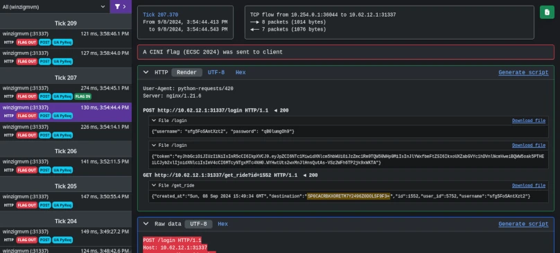

# Shovel

<!--
Copyright (C) 2023-2024  ANSSI
SPDX-License-Identifier: CC0-1.0
-->

Shovel is a web application that offers a graphical user interface to explore
[Suricata Extensible Event Format (EVE) outputs](https://docs.suricata.io/en/suricata-7.0.1/output/eve/eve-json-output.html).
Its primary focus is to help [Capture-the-Flag players](https://en.wikipedia.org/wiki/Capture_the_flag_(cybersecurity))
analyse network flows during stressful and time-limited attack-defense games such as
[FAUSTCTF](https://faustctf.net/), [ENOWARS](https://enowars.com/) or [ECSC](https://ecsc.eu/).
Shovel is developed in the context of
[ECSC Team France](https://ctftime.org/team/159269/) training.



You might also want to have a look at these other awesome traffic analyser tools:

  - https://github.com/secgroup/flower (first commit in 2018)
  - https://github.com/eciavatta/caronte (first commit in 2020)
  - https://github.com/OpenAttackDefenseTools/tulip (fork from flower in May 2022)

Compared to these traffic analyser tools, Shovel only relies on Suricata while
making opinionated choices for the frontend. This has a few nice implications:

  - dissection of all application protocols supported by Suricata (HTTP2, modbus, SMB, DNS, etc),
  - flows payloads and dissections are stored inside SQLite databases for fast queries,
  - ingest can be a folder of pcaps for non-root CTF, or a live capture (less delay),
  - tags are defined using Suricata rules (regex, libmagic match, HTTP header, etc),
  - no heavy build tools needed, Shovel is easy to tweak.

Moreover, Shovel is batteries-included with some Suricata alert rules.

```
        ┌────────────────────────┐
device  │ Suricata with:         │   eve.db    ┌───────────────┐
or pcap │  - Eve SQLite plugin   ├────────────►│               │
───────►│  - TCP payloads plugin │ payload.db  │ Python webapp │
        │  - UDP payloads plugin ├────────────►│               │
        └────────────────────────┘             └────▲──────────┘
                                              .env  │
                                              ──────┘
```

## Getting started

### Services mapping, ticks and flag format configuration

Shovel is configured using environment variables.
Copy `example.env` to `.env` and update the optional configuration parameters.
You may update this file later and restart only the webapp.

Add the flag format in `suricata/rules/suricata.rules` if needed.
If you modify this file after starting Suricata, you may reload rules using
`pkill -USR2 suricata`.

### Network capture

Suricata supports [multiple capture methods](https://docs.suricata.io/en/suricata-7.0.6/support-status.html#id6).
Please use a live capture with `AF_PACKET` when possible,
or `libpcap` if you can't mirror the traffic (archives replay or rootless CTF).

#### pcap capture mode (slower)

Place pcap files in a folder such as `input_pcaps/`.

If you are continuously adding new pcap, add `--pcap-file-continuous` to
Suricata command line.

Then you may start the compose using:
```bash
docker compose up -d
```

If you don't want to use Docker, you may manually launch Suricata and the web
application using the two following commands:
```bash
./suricata/entrypoint.sh -r input_pcaps
(cd webapp && uvicorn --host 127.0.0.1 main:app)
```

> [!TIP]
> If the CTF event does not already provide PCAP files, then you may adapt the
> following command for a GNU/Linux system (22 is SSH):
> ```bash
> ssh root@10.20.9.6 tcpdump -i game -n -w - 'tcp port not 22' | tcpdump -n -r - -G 30 -w input_pcaps/trace-%Y-%m-%d_%H-%M-%S.pcap
> ```
> For a Microsoft Windows system, you may run the following command (3389 is RDP) inside a PowerShell console:
> ```powershell
> &'C:\Program Files\Wireshark\tshark.exe' -i game -w Z:\ -f "tcp port not 3389" -b duration:60
> ```

> [!WARNING]
> Please note that restarting Suricata will cause all network capture files to
> be loaded again. It might add some delay before observing new flows.

#### Live capture mode (faster)

Live capture mode requires access to a network device with the game traffic.
This can be achieved by mirroring vulnbox traffic through a tunnel,
[see FAQ for more details](#how-to-setup-traffic-mirroring-using-openssh).
Here this device is named `tun5`.

Edit `docker-compose.yml` and comment option A and uncomment option B under
`suricata` container definitions.
Then, you may start the compose using:
```bash
docker compose up -d
```

If you don't want to use Docker, you may manually launch Suricata and the web
application using the two following commands:
```bash
sudo ./suricata/entrypoint.sh -i tun5
(cd webapp && uvicorn --host 127.0.0.1 main:app)
```

> [!WARNING]
> Please note that stopping Suricata will stop network capture.

You may run `sudo tcpdump -n -i tun5 -G 30 -w trace-%Y-%m-%d_%H-%M-%S.pcap` for
archiving purposes.

## Frequently Asked Questions

### Is Suricata `flow_id` really unique?

`flow_id` is derived from timestamp (ms scale) and current flow parameters (such
as source and destination ports and addresses). See source code:
<https://github.com/OISF/suricata/blob/suricata-6.0.13/src/flow.h#L680>.

### How to setup traffic mirroring using OpenSSH?

Most CTF uses OpenVPN or Wireguard for the "game" network interface on the vulnbox,
which means you can send the traffic to an OpenSSH `tun` tunnel.
Using this method, Shovel can run on another machine in live capture mode.

> [!WARNING]
> If you need to clone a physical Ethernet interface such as `eth0`,
> you will need to use `-o Tunnel=ethernet -w 5:5` in the SSH command line to create a `tap`.

To achieve traffic mirroring, you may use these steps as reference:

 1. Enable SSH tunneling in vulnbox OpenSSH server:
    ```
    echo -e 'PermitTunnel yes' | sudo tee -a /etc/ssh/sshd_config
    systemctl restart ssh
    ```
 2. Create `tun5` tunnel from the local machine to the vulnbox and up `tun5` on vulnbox:
    ```
    sudo ssh -w 5:5 root@10.20.9.6 ip link set tun5 up
    ```
 3. Up `tun5` on the local machine and start `tcpdump` to create pcap files:
    ```
    sudo ip link set tun5 up
    sudo tcpdump -n -i tun5 -G 30 -Z root -w trace-%Y-%m-%d_%H-%M-%S.pcap
    ```
 4. Mirror `game` traffic to `tun5` on the vulnbox.
    This can be done using Nftables netdev `dup` option on `ingress` and `egress`.

### How do I reload rules without restarting Suricata?

You can edit suricata rules in `suricata/rules/suricata.rules`, then reload the rules
using:
```bash
pkill -USR2 suricata
```
